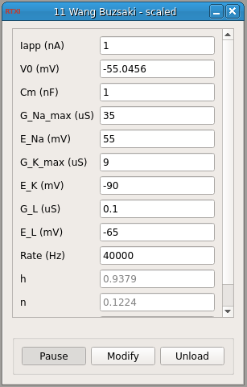

###Wang-Buzsaki Model Neuron

**Requirements:** None  
**Limitations:** None  

The Wang-Buzsaki model uses the Hodgkin-Huxley formalism to describe a single-compartment neuron with sodium and potassium conductances. For the transient sodium current, the activation variable m is assumed fast and substituted by its steady-state function.

Wang XJ, Buzsáki G (1996) Gamma oscillation by synaptic inhibition in a hippocampal interneuronal network model. J. Neurosci. 16: 6402–6413.

####Input Channels
1. input(0) - Istim : input current  (A)

####Output Channels
1. output(0) - Vm : membrane voltage (V)

####Parameters
1. Iapp - applied current (nA)
1. V0 - voltage (mV)
2. Cm - membrane capacitance (nF/cm^2)
3. G_Na_max - max. Na+ conductance density (uS/cm^2)
4. E_Na - Na+ reversal potential (mV)
5. G_K_max - max. K+ conductance density (uS/cm^2)
6. E_K - K+ reversal potential (mV)
7. G_L - leak channel conductance density (uS/cm^2)
8. E_L - leak channel reversal potential (mV)
10. rate - rate of integration (Hz)

####States
1. h - sodium inactivation
2. n - potassium inactivation
3. Time - time (s)
